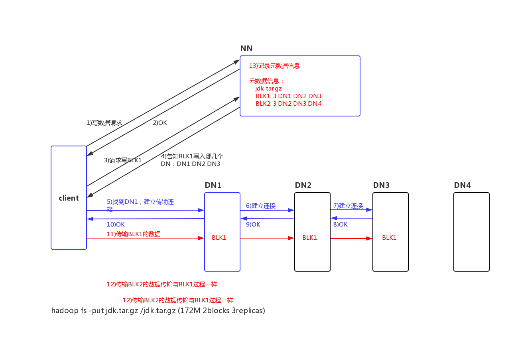
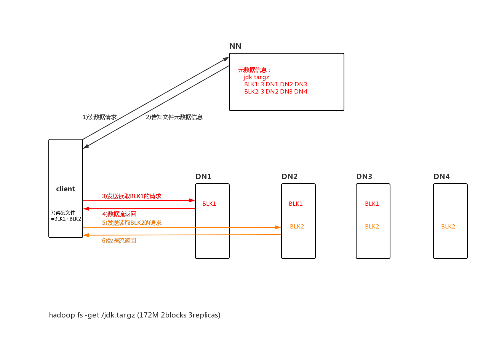
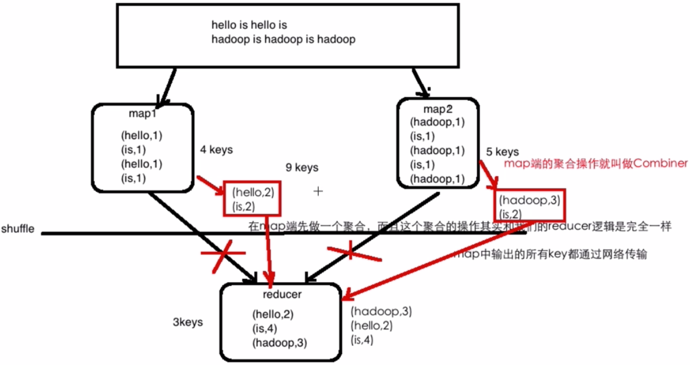

# 第一章 大数据概述

---

### 大数据之4V特征
- 数据量（Volume）
- 多样性、复杂性（Variety）
- 基于高度分析的新价值（Value）
- 速度（Velocity）

### 大数据带来的技术变革
- 存储：文件存储-->分布式存储
- 计算：单机-->分布式计算
- 网络：万兆
- DB：RDBMS-->NoSQL(HBase/Redis...)

### 大数据技术概念
- 数据采集：flume、sqoop
- 数据存储：hadoop
- 数据处理、分析、挖掘：hadoop、spark、flink
- 可视化

### 大数据在技术架构上带来的挑战
- 对现有数据库管理技术的挑战
- 经典数据库技术并没考虑数据的多类别
- 实时性的技术挑战
- 网络架构、数据中心、运维的挑战
- 数据隐私
- 数据源复杂多样

# 第二章 初识Hadoop

---
- Hadoop概述
- Hadoop核心组件
- Hadoop优势
- Hadoop发展史
- Haoop生态系统
- Hadoop发行版的选择

### Hadoop概述
### Hadoop核心组件之HDFS概述
### Hadoop核心组件之MapReduce概述

### Hadoop核心组件之资源调度系统YARN
### Hadoop优势
- 高可靠性
    - 数据存储：数据块多副本
    - 数据计算：重新调度作业计算
- 高扩展性
    - 存储/计算资源不足可以横向扩展机器
    - 一个集群可以有数以千计的节点
- 廉价机器成本低
- 成熟的生态圈
### Hadoop发展史
- InfoQ上有篇文章《Hadoop十年解读与发展预测》https://www.infoq.cn/article/hadoop-ten-years-interpretation-and-development-forecast
- Dung Cutting Hadoop 10th birthday https://www.cloudera.com/promos/hadoop10.html

### Haoop生态系统
### Hadoop发行版
- Apache
    - 优点：纯开源
    - 缺点：不同版本、不同框架之间整合，jar冲突到吐血
- CDH（Cloudera）
    - 网站：https://www.cloudera.com
    - 优点：cm(cloudera manager)通过页面意见安装各种框架、升级、impala
    - 缺点：cm不开源、与社区版本有些许出入
    - 国内市场占60-70%
- HDP（Hortonworks）
    - 优点：原装Hadoop、春开源、支持tez
    - 缺点：企业级安全不开源、文档不好
- MapR（不建议）
- 优先考虑CDH和HDP，这两种安装部署方面更方便


# 第三章 分布式文件系统HDFS

### 3-1 HDFS概述
- 分布式
- commodity hardware
- highly fault-tolerant 
- high throughput
- large data sets

### 3-2 HDFS设计前提与目标
- Hardware Failure
    - 硬件错误是常见的
    - 每个机器只存储文件的部分数据 
- Streaming Data Access
    - more for batch processing rather than interactive use by users
    - high throughput of data access rather than low latency of data access
- Large Data Sets
- Moving Computation is Cheaper than Moving Data
    - 移动计算比移动数据更划算
    - HDFS提供了接口移动计算到数据附近

### 3-3 HDFS架构（五星）
- 架构图官网https://hadoop.apache.org/docs/stable/hadoop-project-dist/hadoop-hdfs/HdfsDesign.html
- NameNode(Master) and DataNodes(Slaves)
- master/slave架构
- NN
    - manage the file system namespace
    - regulate access to files by clients
- DN
    - manage storage
- HDFS exposes a file system namespace and allows user data to be stored in files
- a file is split into one or more blocks
    - blocksize:128M
    - 150M文件需要两个blocks
- blocks are stored in a set of DataNodes
    - 容错
- NameNode executes file system namespace operations
- NameNode determines the mapping of blocks to DataNodes

### 3-4 文件系统NameSpace详解
- Similar to most other existing file systems
- NN maintains the file system namespace
- Any change to the file system namespace or its properties is recorded by the NN

### 3-5 HDFS副本机制
- HDFS stores each file as a sequence of blocks
- The blocks of a file are replicated for fault tolerance
- The block size and replication factor are configurable
- Files in HDFS are write-once (except for appends and truncates) and have strictly one writer at any time
- The NameNode makes all decisions regarding replication of blocks
- Replica Placement
    - The purpose of a rack-aware replica placement policy is to improve data reliability, availability, and network bandwidth utilization
    - The NameNode determines the rack id each DataNode belongs to via Hadoop Rack Awareness
    - When the replication factor is three, HDFS’s placement policy is to put one replica on the local machine if the writer is on a datanode, otherwise on a random datanode in the same rack as that of the writer, another replica on a node in a different (remote) rack, and the last on a different node in the same remote rack（三个replica，一个在datanode writer的local机器，另一个在一个不同的remote机架的机器上，最后一个在那个remote机架的不同机器上）
    - If the replication factor is greater than 3, the placement of the 4th and following replicas are determined randomly while keeping the number of replicas per rack below the upper limit (which is basically (replicas - 1) / racks + 2)（第四个replica随机分机架，且保证每小于每个机架的replca的上限）
    - NameNode does not allow DataNodes to have multiple replicas of the same block
- Replica Selection
    - HDFS tries to satisfy a read request from a replica that is closest to the reader
    - 能从本机、本机架、本数据中心读就不从remote的读
- Safemode
    - On startup, the NameNode enters a special state called Safemode 启动时NN进入Safemode状态
    - Replication of data blocks does not occur 此状态下数据块不进行复制
    - The NameNode receives Heartbeat and Blockreport messages from the DataNodes Blockreport包含此DN的数据块列表
    - A block is considered safely replicated when the minimum number of replicas of that data block has checked in with the NameNode 每个block中的最小副本数被注册进NN后block被认为可以安全复制了
    - After a configurable percentage of safely replicated data blocks checks in with the NameNode (plus an additional 30 seconds), the NameNode exits the Safemode state 可安全复制的replica比例超过一定配置值时NN退出Safemode
    - 再之后NN把所有剩余的未满副本的blocks都复制

### 3-7 Hadoop部署前置介绍
- Hadoop使用版本：CDH 
- CDH下载：http://archive.cloudera.com/cdh5/cdh/5/
- hadoop版本：hadoop-2.6.0-cdh5.15.1 (hadoop-2.6.0-cdh5.15.1.tar.gz)
    - hadoop下载：wget http://archive.cloudera.com/cdh5/cdh/5/hadoop-2.6.0-cdh5.15.1.tar.gz
    - hive版本：hive-1.1.0-cdh5.15.1 注意最后的cdh版本各个组件要一致
    - cdh5.15.1官网文档 http://archive.cloudera.com/cdh5/cdh/5/hadoop-2.6.0-cdh5.15.1/
- hadoop安装前置要求：jdk1.8+、ssh
    - jdk 略
    - ssh免密登录
        - ssh-keygen -t rsa
            - id_rsa私钥
            - id_rsa.pub公钥
        - cat ~/.ssh/id_rsa.pub >> ~/.ssh/authorized_keys
        - chmod 600 ~/.ssh/authorized_keys

### 3-10 Hadoop安装配置standalone
- 下载解压
- 添加HADOOP_HOME/bin到系统环境变量
- 修改Hadoop配置文件
    - hadoop-env.sh
        - export JAVA_HOME=/home/hadoop/app/jdk1.8.0_91
        - HADOOP_PREFIX不用配用默认的就好
    - core-site.xml
        ```
        #主节点的文件的系统在hadoop000的8020上
        <property>
            <name>fs.defaultFS</name>
            <value>hdfs://hadoop000:8020</value>
        </property>
        #建议用8020端口，9000是hadoop1中的
        ```
    - hdfs-site.xml
        ```
        #副本系数，默认是3，但现在只有1个节点
        <property>
            <name>dfs.replication</name>
            <value>1</value>
        </property>
        
        #文件系统文件临时数据块存放的地方，默认是在/tmp中的，重启就清空了，所以需要改掉
        <property>
            <name>hadoop.tmp.dir</name>
            <value>/home/hadoop/app/tmp</value>
        </property>
        ```
    - slaves
        ```
        hadoop000
        ```
- 启动HDFS
    - hdfs namenode -format(第一次执行的时候一定要格式化文件系统，不要重复执行)
    - sbin/start-dfs.sh
    - jps
        ```
        48144 NameNode
        48530 Jps
        48420 SecondaryNameNode
        48231 DataNode
        ```
- 浏览器访问hadoop
    - 查看防火墙 sudo firewall-cmd --state
    - 关闭防火墙 sudo systemctl stop firewalld.service
    - 访问hadoop web界面 hadoop000:50070


### 3-15 HDFS命令行操作详解*****
http://archive.cloudera.com/cdh5/cdh/5/hadoop-2.6.0-cdh5.15.1/hadoop-project-dist/hadoop-common/FileSystemShell.html

### 3-16 编程环境搭建
- pom.xml最佳实践
    ```
    <?xml version="1.0" encoding="UTF-8"?>
    
    <project xmlns="http://maven.apache.org/POM/4.0.0" xmlns:xsi="http://www.w3.org/2001/XMLSchema-instance"
      xsi:schemaLocation="http://maven.apache.org/POM/4.0.0 http://maven.apache.org/xsd/maven-4.0.0.xsd">
      <modelVersion>4.0.0</modelVersion>
    
      <groupId>com.imooc.bigdata</groupId>
      <artifactId>hadoop-train-v2</artifactId>
      <version>1.0</version>
    
      <name>hadoop-train-v2</name>
      <!-- FIXME change it to the project's website -->
      <url>http://www.example.com</url>
    
      <properties>
        <!--定义Hadoop版本-->
        <hadoop.version>2.6.0-cdh5.15.1</hadoop.version>
      </properties>
    
      <!--引入cdh仓库-->
      <repositories>
        <repository>
          <id>cloudera</id>
          <url>https://repository.cloudera.com/artifactory/cloudera-repos</url>
        </repository>
      </repositories>
    
      <dependencies>
        <!--添加Hadoop的依赖包-->
        <dependency>
          <groupId>org.apache.hadoop</groupId>
          <artifactId>hadoop-client</artifactId>
          <version>${hadoop.version}</version>
        </dependency>
    
        <!--添加junit的依赖包-->
        <dependency>
          <groupId>junit</groupId>
          <artifactId>junit</artifactId>
          <version>4.11</version>
          <scope>test</scope>
        </dependency>
      </dependencies>
    
    </project>

    ```

### 3-17 HDFS API编程
- Permission denied exception
    ```
    # Exception
    Caused by: org.apache.hadoop.ipc.RemoteException(org.apache.hadoop.security.AccessControlException): Permission denied: user=milesyli, access=WRITE, inode="/":hadoop:supergroup:drwxr-xr-x
    
    # 原因：对其他用户没有w权限
    hadoop@hadoop000 hadoop-2.6.0-cdh5.15.1]$ hadoop fs -ls /
    Found 3 items
    -rw-r--r--   1 hadoop supergroup      85063 2019-11-01 15:01 /LICENSE.txt
    -rw-r--r--   1 hadoop supergroup       1366 2019-11-01 14:59 /README.txt
    
    # 解决：第三个参数穿个hadoop进去
    FileSystem fileSystem = FileSystem.get(new URI("hdfs://hadoop000:8020"), configuration, "hadoop");
    ```

### 3-30 HDFS API实现词频统计

### 3-38 副本摆放策略
- 本地机架一个replica
- 远程机架一个replica
- 远程机架另一个replica

### 3-39 HDFS写入过程


### 3-40 HDFS读取过程


### 3-41 HDFS Checkpoint详解
- HDFS的元数据管理
    - 元数据
        - HDFS目录结构
        - 每个文件的BLOCK信息（id、副本数、在哪些DN）
    - 存在什么地方
        - 在${hadoop.tmp.dir}/dfs/name/current
- checkpoint机制
    

# 第四章 分布式计算框架MapReduce

### 4-2 MapReduce概述
- Google MapReduce论文发表于2004.12
- Hadoop MapReduce是Google MapReduce的克隆版
- MapReduce优点
    - 海量数据离线处理
    - 易开发，与自己开发相比
    - 易运行
- MapReduce缺点
    - 实时流式计算

### 4-3 MapReduce编程模型
- 作业差分成Map阶段、Reduce阶段
- Map阶段：Map Tasks
- Reduce阶段：Reduce Tasks

### 4-4 MapReduce编程模型详解
- MapReduce编程模型执行步骤
    - 准备map处理的输入数据
    - Mapper处理
    - Shuffle
    - Reduce处理
    - 输出结果
- MapReduce源码流程图
    - 
- MapReduce编程模型之核心概念(务必要掌握原理！面试常问)
    - split
    - InputFormat
    - OutputFormat
    - Combiner
    - Partitioner

### 4-10 Combiner操作
- 
- Combiner的优点：减少IO，抬升作业的执行性能
- Combiner的局限性：求平均数、除法等操作

### 4-11至4-17看代码Access
- mr/access下

### 4-17自定义Partitioner
- Mapper的输出数据 通过shuffle 按默认的key（也可自定义）分发到不同的reducer中去
- 
